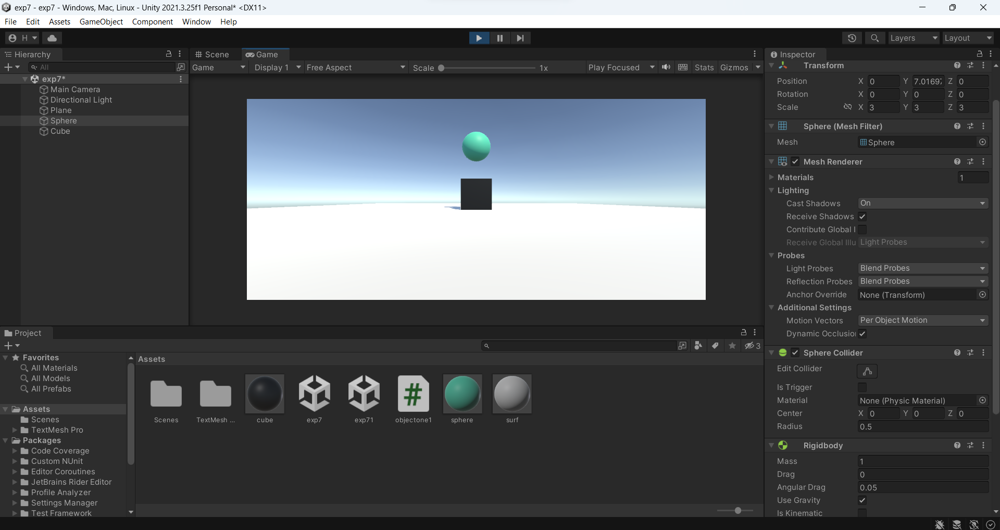
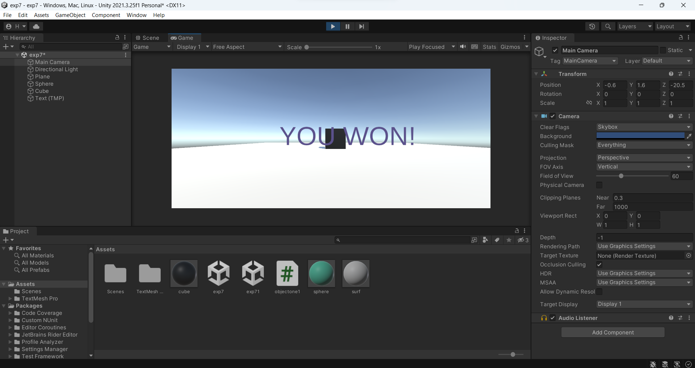
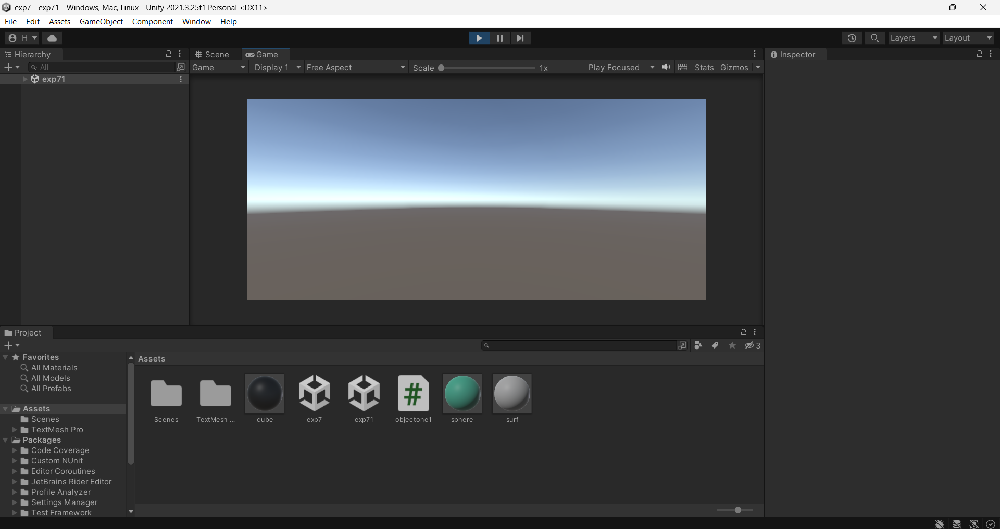

# REDIRECTING THE SCENE 
## AIM:
To redirect a scene using C# program in Unity engine.

## ALGORITHM:
### STEP 1:
To open the unity engine.

### STEP 2:
Create a new plane and create a cube and give color for the cube.

### STEP 3:
Next create sphere in the origin and change the z-axis and Give the color for the sphere.

### STEP 4:
Create a tag for the Sphere and Make the sphere and cube as a Rigidbodies and Make the sphere use Gravity.

### STEP 5:
Create the C# script file in the Assets and write the Coding for the Redirecting to the scene1 after hit the sphere to cube.

### STEP 6:
Next Create another new scene named as scene1.

### STEP 7:
In File->Build settings and drop the both first scene and scene1 scene in the Scenes in build setting.

### STEP 8:
Click the Build and run button in the Build settings and run the scene.

### STEP 9:
The Sphere after touching the cube it will disappeared and Press the key [R] the redirecting to the new scene that is scene1.

## PROGRAM:
```
NAME : PAARKAVY B
REG NO : 212221230072
```

```
using System.Collections;
using System.Collections.Generic;
using UnityEngine.SceneManagement;
using UnityEngine;

public class objectone1 : MonoBehaviour
{
    Rigidbody rb;
    public GameObject WinText;
    // Start is called before the first frame update
    void Start()
    {
        rb = GetComponent<Rigidbody>();
    }

    // Update is called once per frame
    void Update()
    {
        if (Input.GetKeyDown(KeyCode.R))
        {
            SceneManager.LoadScene("exp71");
        }
    }
    public void OnMouseDown()
    {
        Destroy(gameObject);
    }
    private void OnCollisionEnter(Collision collision)
    {
        if (collision.gameObject.tag == "square")
        {
            Destroy(collision.gameObject);
            WinText.SetActive(true);
        }
    }
}
```

## OUTPUT:






## RESULT:
Thus, a scene is redirected in Unity engine using a C# program.
